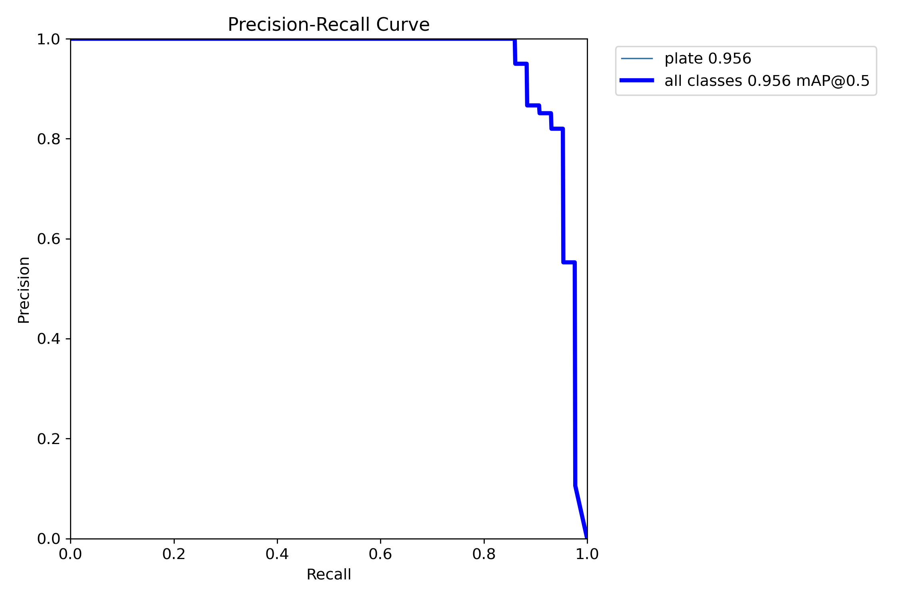
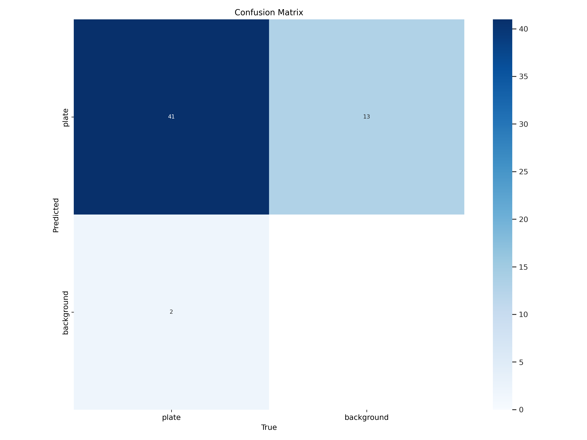

# Car Plate Detection using YOLOv8

An object detection project that uses Ultralytics' YOLOv8 model to detect car plates in images. This repository contains the annotated dataset, training scripts, and instructions to reproduce the results.

## Table of Contents

- [Introduction](#introduction)
- [Dataset](#dataset)
- [Installation](#installation)
- [Training](#training)
- [Results](#results)
- [Usage](#usage)
- [Project Structure](#project-structure)
- [Acknowledgments](#acknowledgments)

## Introduction

The goal of this project is to develop a robust car plate detection system using the YOLOv8 object detection model. The dataset includes images of cars with annotated license plates. The model is trained to accurately detect and localize car plates in various conditions.

## Dataset

The dataset is organized into three subsets:

- **Training Set** (`train`): Used to train the model.
- **Validation Set** (`valid`): Used to validate the model during training.
- **Test Set** (`test`): Used to evaluate the final model performance.

Each subset contains:

- **Images**: Located in the `images` folder, in `.png` format.
- **Labels**: Corresponding annotations in YOLO format, located in the `labels` folder.

### Data Annotation

The images were annotated using [LabelImg](https://github.com/HumanSignal/labelImg), an open-source graphical image annotation tool. For installation instructions, please refer to the [LabelImg website](https://github.com/HumanSignal/labelImg).

## Installation

### Prerequisites

- Python 3.8
- Conda package manager
- NVIDIA GPU with CUDA support (optional, but recommended for faster training)

### Steps

1. **Clone the Repository**

     ```bash
   git clone https://github.com/your_username/your_repository.git
   cd your_repository
   ```

2. **Create a Virtual Environment**

     ```bash
   conda create -n car-plate python=3.8
   conda activate car-plate
   ```

3. **Install Dependencies**

     ```bash
   pip install -r requirements.txt
   ```

   *Note*: The `requirements.txt` contains:

    ```bash
   ultralytics==8.2.64
   ```

## Training

### Data Configuration

Ensure the `data.yaml` file is correctly set up. It should contain:

```yaml
train: ./train/images
val: ./valid/images
test: ./test/images

nc: 1
names: ['car_plate']
```

- **train**, **val**, **test**: Paths to the respective image directories.
- **nc**: Number of classes (in this case, 1 for car plates).
- **names**: List of class names.

### Training Command

Train the model using the following command:

```bash
yolo task=detect mode=train model=yolov8n.pt data=./data.yaml epochs=50 imgsz=640 augment=True
```

- **Parameters**:
  - `task=detect`: Specifies the detection task.
  - `mode=train`: Sets the mode to training.
  - `model=yolov8n.pt`: Starts from the pre-trained YOLOv8 nano model.
  - `data=./data.yaml`: Uses the specified data configuration file.
  - `epochs=50`: Number of training epochs.
  - `imgsz=640`: Image size for training.
  - `augment=True`: Enables data augmentation.

### Training with Google Colab

You can also train the model using the `YOLOv8_train.ipynb` notebook in Google Colab:

1. Upload the dataset and notebook to your Google Drive.
2. Open the notebook in Google Colab.
3. Adjust the paths in the notebook to point to your dataset.
4. Run all cells to start training.

## Results

Training artifacts and results are saved in the `runs/detect/train` directory.

### Key Outputs

- **Model Weights**:
  - `best.pt`: Best model based on validation metrics.
  - `last.pt`: Model from the final training epoch.

- **Training Metrics**:
  - `results.png`: Overview of training metrics over epochs.
  - `F1_curve.png`: F1 score vs. confidence threshold.
  - `PR_curve.png`: Precision-Recall curve.
  - `confusion_matrix.png`: Confusion matrix of predictions.

- **Sample Images**:
  - `train_batch0.jpg`, `train_batch1.jpg`, `train_batch2.jpg`: Sample training images with annotations.
  - `val_batch0_pred.jpg`, `val_batch1_pred.jpg`: Validation images with model predictions.

### Visualizations

- **Precision-Recall Curve**

  

- **Confusion Matrix**

  

## Usage

Use the trained model to detect car plates in new images:

```bash
yolo task=detect mode=predict model=./runs/detect/train/weights/best.pt source=./your_image_or_directory
```

- **source**: Path to an image file or a directory of images.

### Example

```bash
yolo task=detect mode=predict model=./runs/detect/train/weights/best.pt source=./test/images save=True
```

- **save=True**: Saves the prediction images with bounding boxes in the `runs/detect/predict` directory.

## Project Structure

```
.
├── data.yaml
├── README.md
├── requirements.txt
├── YOLOv8_train.ipynb
├── train/
│   ├── images/
│   └── labels/
├── valid/
│   ├── images/
│   └── labels/
├── test/
│   ├── images/
│   └── labels/
├── runs/
│   └── detect/
│       └── train/
│           ├── weights/
│           │   ├── best.pt
│           │   └── last.pt
│           ├── results.png
│           ├── PR_curve.png
│           ├── confusion_matrix.png
│           └── ... (other artifacts)
```

## Acknowledgments

- **Ultralytics YOLOv8**: [GitHub Repository](https://github.com/ultralytics/ultralytics)
- **LabelImg**: [GitHub Repository](https://github.com/HumanSignal/labelImg)
